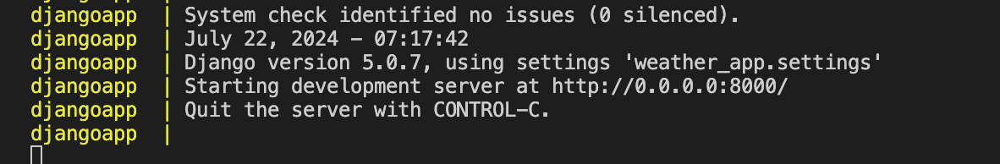
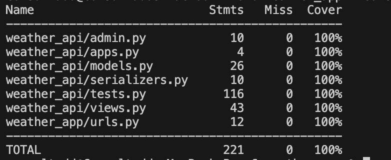
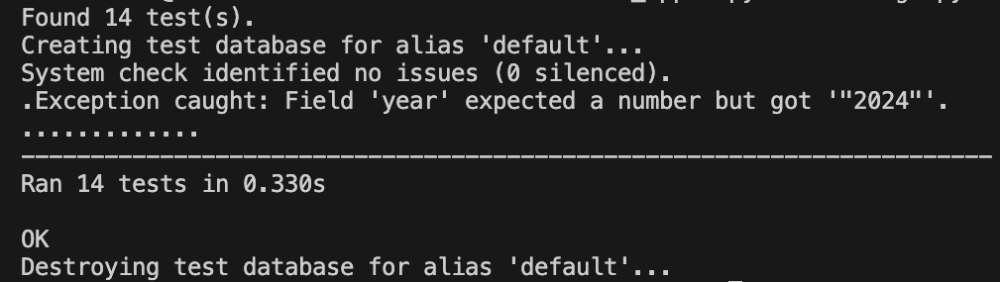
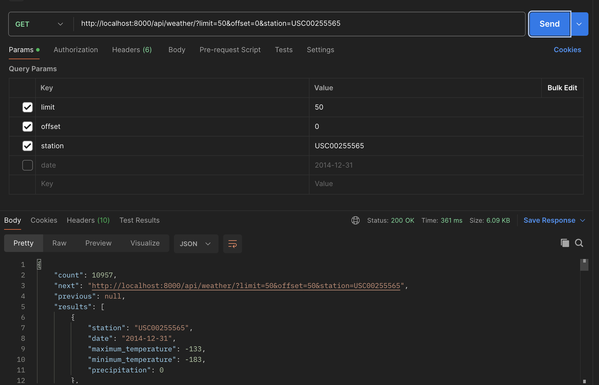
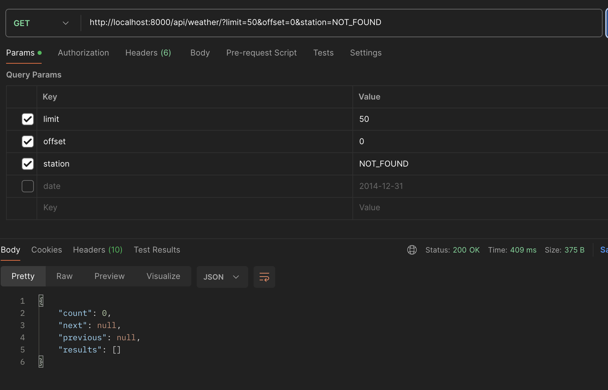
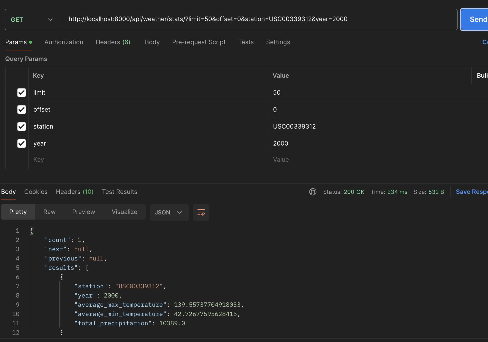
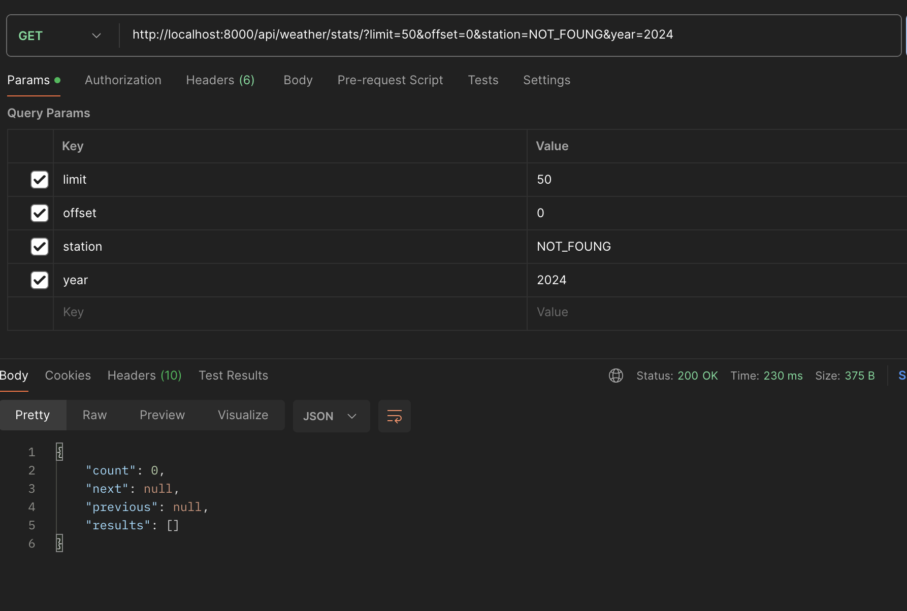
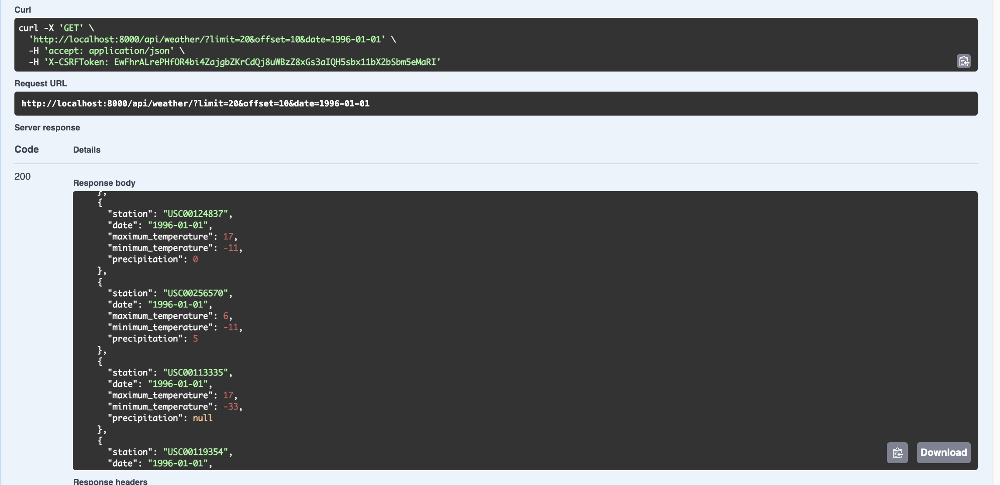
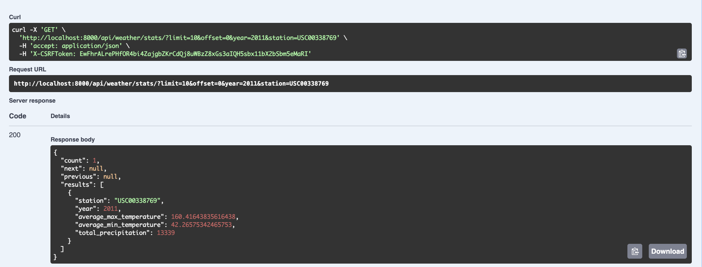

# Weather API with Django
This project provides a Weather API built with Django. It includes endpoints to retrieve weather data and statistics, and comes with integrated Swagger and ReDoc documentation for easy API exploration.

# Endpoints
There are 4 endpoints in this project:-
  1. `/api/weather/`
  2. `/api/weather/stats/`
  3. `/swagger`
  4. `/redoc`

# Project Structure
```bash
.
├── venv/
└── weather_app/
    ├── data/
    │   ├── wx_data/
    │   └── yld_data
    ├── screenshots/
    ├── weather_api/
    │   ├── management/
    │   │   └── commands/
    │   │       └── create.py
    │   ├── __init__.py
    │   ├── admin.py
    │   ├── apps.py
    │   ├── dump.py
    │   ├── models.py
    │   ├── serializers.py
    │   ├── tests.py
    │   └── views.py
    ├── weather_app/
    │   ├── __init__.py
    │   ├── asgi.py
    │   ├── settings.py
    │   ├── urls.py
    │   └── wsgi.py
    ├── .coveragerc
    ├── .env
    ├── docker-compose.yml
    ├── Dockerfile
    ├── log.log
    ├── manage.py
    ├── readme.md
    ├── requirements.txt
    └── start
```
# Project Setup and Installation
1. Clone the project
2. Install the docker using this  [link](https://docs.docker.com/engine/install/).
3. Run the docker container using below command:-
```bash
docker-compose up --build
```



# To access the API endpoints
You can access the following API endpoints:

- **Retrieve Weather Records:** `/api/weather/`
  
- **Retrieve Weather Statistics:** `/api/weather/stats/`

- **View the Swagger Documentation:** `/swagger`

- **View the ReDoc API Documentation:** `/redoc`


# Testing
To run the testcases use this command:-
```bash
python manage.py test
```
# Coverage
To get the coverage use this command:-
```bash
coverage run --source='.' manage.py test
coverage report
```


### Screenshot of Testcase output


# Screenshots of API Response

<br><br>

<br><br>

<br><br>


# Screenshots of Swagger Response

<br><br>


##

### To open AWS Deployment Steps please follow the link ([approach.md](/weather_app/approach.md))